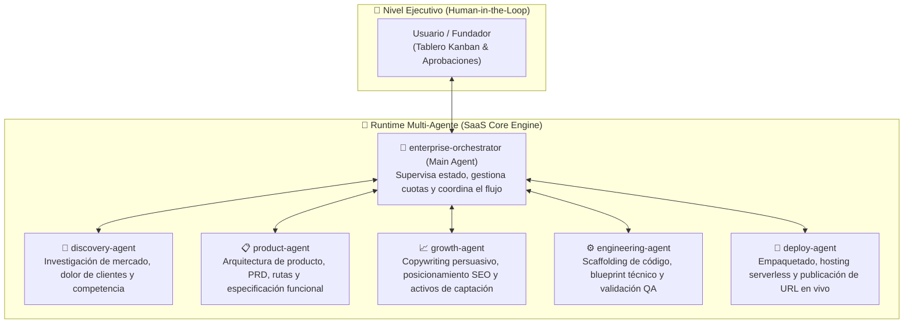

# 🏢 Virtual Enterprise — Fábrica Autónoma de Micro-SaaS (v0.1.0 MVP)

> **Plataforma multi-agente en runtime inspirada en [Google Antigravity Custom Agents](https://antigravity.google/blog/introducing-custom-agents) y potenciada por Google Gemini 3.8 Flash con preservación de Thought Signatures.**

---

## 🌟 1. Visión y Propósito

**Virtual Enterprise** es un SaaS multi-agente donde los departamentos de una empresa tecnológica (Dirección General, Investigación de Mercado, Producto, Marketing, Ingeniería y DevOps) operan como **agentes autónomos de IA**.

El sistema funciona bajo el principio de **supervisión ejecutiva Human-in-the-Loop (HITL)**: el usuario actúa como la Junta Directiva desde un tablero Kanban interactivo, aprobando el avance de cada micro-SaaS por las diferentes etapas operativas o rechazando con feedback para que los agentes re-evalúen sus entregables.

---

## 📐 2. Arquitectura del Colectivo Multi-Agente



### Especificación Oficial Antigravity (`.agents/agents/`)
Los roles y directivas de los agentes se declaran formalmente bajo el estándar de Google Antigravity:
- **`enterprise-orchestrator.md`**: Agente Principal (`mainAgent: true`).
- **`discovery-agent.md`**: Subagente de mercado y nichos (`subagent: true`).
- **`product-agent.md`**: Subagente de especificación PRD (`subagent: true`).
- **`growth-agent.md`**: Subagente de copywriting y SEO (`subagent: true`).
- **`engineering-agent.md`**: Subagente de arquitectura y QA (`subagent: true`).
- **`deploy-agent.md`**: Subagente de infraestructura y despliegue (`subagent: true`).

---

## 🤖 3. Gobernanza de Modelos de IA (Regla 12)

- **Modelo Predeterminado**: **`gemini-3.8-flash`** (configurable dinámicamente mediante `GEMINI_MODEL`).
- **Thought Signatures**: Los agentes capturan la firma de pensamiento (`thought_signature` / `thought`) del payload de respuesta y la recirculan en turnos conversacionales sucesivos para preservar la integridad del razonamiento.
- **Fallback Determinista**: En caso de ausencia de `GEMINI_API_KEY`, el sistema opera en modo sandbox con respuestas estructuradas validadas formalmente por **Zod**.

---

## 🚀 4. Inicio Rápido

### Requisitos Previos
- Node.js 18+ (recomendado Node 20 o 24).
- NPM 9+.

### Instalación y Ejecución
```bash
# 1. Clonar e instalar dependencias
git clone https://github.com/ClaudioCeppi83/virtual-enterprise.git
cd virtual-enterprise
npm install

# 2. Iniciar el servidor de desarrollo
npm run dev

# 3. Abrir en el navegador
# http://localhost:3000 (o el puerto configurado)
```

### Ejecución de Pruebas
```bash
# Validar tipos TypeScript sin emitir código
npm run type-check

# Ejecutar pruebas de integración de los agentes y orquestador
npx tsx tests/pipeline.test.ts
```

---

## 🗺️ 5. Hoja de Ruta (Roadmap)

| Versión | Alcance y Capacidades | Estado |
| :--- | :--- | :---: |
| **v0.1.0 MVP** | **Sandbox Interactivo & Motor Multi-Agente en Runtime**: Pipeline de 6 etapas, contratos Zod, inferencia con Gemini 3.8 Flash con thought signatures, tablero Kanban HITL y telemetría en tiempo real. |  **Completado** |
| **v0.2.0** | **Generación Física de Archivos & Hosting Real**: Clonado de plantillas Next.js/Vite en disco (`/builds/`), generación física de componentes `.tsx` y despliegue real en Firebase Hosting vía `firebase-tools`. | 🔮 En diseño |
| **v0.3.0** | **Monetización Automática**: Integración con Stripe Billing para micro-SaaS generados y analítica de uso en producción. | 🔮 Futuro |

---

## 📄 Licencia
Este proyecto es software propietario desarrollado por Claudio Ceppi bajo el ecosistema de Google Antigravity.
